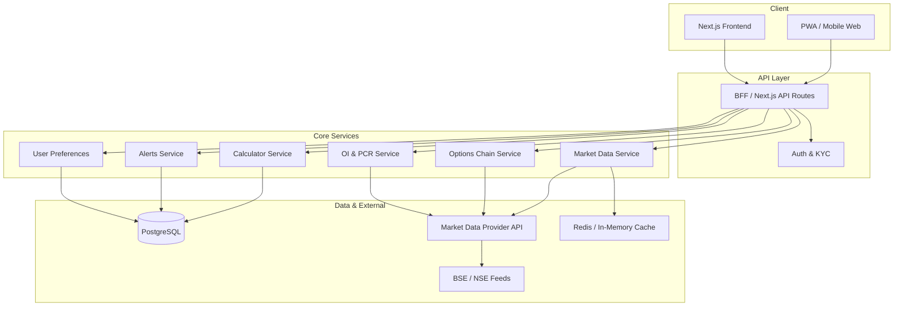

# F&O Module – Feature Blueprint

**Trade & Invest → Futures & Options (F&O)**  
**Target users:** Retail traders in India (index and stock derivatives)  
**Entry point in app:** Header → Trade & Invest → F&O → `/products/options`

---

## 1. Feature List

### 1.1 Core Features

| Feature | Description | Priority |
|--------|-------------|----------|
| **Real-time price data** | Live/15-min delayed LTP for Nifty, Bank Nifty, Fin Nifty, Midcap, Sensex and F&O underlyings; futures and options strikes with bid/ask, last price, volume | P0 |
| **Options chain** | Full chain view: strikes, CE/PE OI, change in OI, IV (%), LTP, volume; filter by expiry, sort by OI/IV; export CSV | P0 |
| **Open interest (OI) analysis** | OI by strike, by expiry; OI build-up vs price; OI-based support/resistance; long vs short build-up (if data available) | P0 |
| **Put/Call ratio** | PCR (OI and volume); spot vs strike-wise; expiry-wise; historical PCR for context | P0 |
| **Strategy builder** | Pre-built: straddle, strangle, bull/bear spread, iron condor, butterfly; custom 2–4 leg builder with net premium and breakevens | P0 |
| **Payoff calculator** | Single option and multi-leg payoff; P&L at expiry and at date; chart (P&L vs underlying); margin impact (approximate) | P0 |
| **Multi-timeframe charting** | 1m, 3m, 5m, 15m, 30m, 1H, 1D; candlestick/line; fullscreen; sync with options chain (underlying) | P0 |
| **Indicators** | RSI, MACD, EMA (9/21/50), VWAP, Bollinger Bands; overlay on chart; configurable params | P0 |

### 1.2 User Experience

| Feature | Description | Priority |
|--------|-------------|----------|
| **Mobile-first UI** | Responsive layout; bottom sheets for chain/calculator; swipe between underlyings; touch-friendly order flow | P0 |
| **Fast order flow (simulation)** | Paper/simulation: select strike → CE/PE → qty → order type → confirm; minimal taps; optional one-tap from chain | P1 |
| **Risk–reward visualization** | Per-trade and portfolio: max loss, max profit, breakeven; payoff chart; margin usage bar | P0 |
| **Alerts** | Price (above/below), OI change %, volatility (IV) threshold; in-app + optional push/email; manage in “My Alerts” | P1 |

### 1.3 Analytical Tools

| Feature | Description | Priority |
|--------|-------------|----------|
| **IV analysis** | Current IV vs historical range; IV percentile/rank; IV skew by strike; compare across expiries | P0 |
| **Max pain** | Max pain strike and value at expiry; table and simple chart | P1 |
| **Support/resistance from options** | High OI strikes as S/R; change in OI at levels; optional heatmap | P1 |
| **Smart signals / suggestions** | Rule-based: e.g. “High OI at 24,000 CE”, “PCR &lt; 0.7”, “IV in top 20%”; non-advice, labeled as “Observations” | P2 |

### 1.4 Compliance & Safety

| Feature | Description | Priority |
|--------|-------------|----------|
| **Risk disclaimer** | On first F&O visit and in order flow: “F&O is risky; you may lose more than margin” | P0 |
| **No financial advice** | All signals/labels as “Informational / Educational”; no “Buy/Sell” recommendations | P0 |
| **SEBI-friendly structure** | Risk-based disclosure; KYC/segment consent; audit trail; terms for derivatives; optional risk profiling | P0 |

### 1.5 Monetization (Modular)

| Layer | Description |
|-------|-------------|
| **Premium signals** | Curated OI/IV/sentiment “observations”; subscription (monthly/quarterly) |
| **Indicator subscriptions** | Pro indicators, custom scans, multi-symbol alerts |
| **Advanced analytics** | IV surface, historical OI analytics, backtest of strategies (paid tier) |

### 1.6 Scalability & Extensibility

| Extension | How it fits |
|-----------|-------------|
| **AI signals** | New “AI Insights” module consuming same market + OI + IV data; separate subscription |
| **Algo trading** | Strategy builder → “Export for Algo”; later connect to execution API (broker) |
| **Community trades** | Optional “Community” tab: anonymized ideas/positions (no advice); report/flag; modular feature flag |

---

## 2. Suggested UI Layout

### 2.1 Route Structure

```
/products/options                    → F&O Hub (underlying selector + quick tools)
/products/options/[symbol]            → Options chain + chart for one underlying
/products/options/strategy-builder    → Multi-leg strategy builder
/products/options/payoff-calculator  → Standalone payoff calculator
/products/options/alerts              → My Alerts
/products/options/iv-analysis         → IV analysis (or tab under [symbol])
```

### 2.2 F&O Hub (`/products/options`)

- **Header:** “Futures & Options” + back to Trade & Invest.
- **Underlying selector:** Horizontal chips or dropdown: Nifty 50, Bank Nifty, Fin Nifty, Midcap Select, Sensex, or search stock F&O.
- **Quick cards:** “Options Chain”, “Strategy Builder”, “Payoff Calculator”, “IV Analysis”.
- **Recent / Favourites:** Last viewed underlyings or saved symbols.
- **Disclaimer strip:** Short risk disclaimer + “Not financial advice”.

### 2.3 Options Chain Page (`/products/options/[symbol]`)

- **Top:** Symbol name, spot/LTP, day change; expiry selector (dropdown or tabs).
- **Layout (desktop):** Two-column or single scroll:
  - **Left:** Puts (strikes, OI, change in OI, IV, LTP).
  - **Center:** Strike column (shared).
  - **Right:** Calls (same fields).
- **Layout (mobile):** Tabs “Puts | Calls” or stacked; strike column sticky; bottom sheet for strike detail.
- **Toolbar:** Sort (OI, IV, volume), filter (ITM/OTM/ATM), “Add to strategy”, “Set alert”.
- **Chart:** Collapsible section below or side panel; timeframe and indicator selector.

### 2.4 Strategy Builder (`/products/options/strategy-builder`)

- **Underlying + expiry** selector at top.
- **Legs:** Add leg (CE/PE, strike, qty, buy/sell); list of legs with net premium and breakevens.
- **Templates:** Straddle, Strangle, Spreads, etc. (one tap to fill legs).
- **Payoff preview:** Inline mini payoff chart; link to full Payoff Calculator.
- **Margin (simulated):** Approximate margin if data available.

### 2.5 Payoff Calculator (`/products/options/payoff-calculator`)

- **Input:** Same leg builder or “Load from Strategy Builder”.
- **Output:** Payoff table (price points vs P&L); payoff chart (underlying on X, P&L on Y).
- **Options:** “At expiry” vs “At date” (if model available); currency (INR).

### 2.6 Alerts & IV (shared patterns)

- **Alerts:** List of alerts; FAB or “+” to add; form: symbol, condition (price/OI/IV), value, channel (in-app/push/email).
- **IV Analysis:** Symbol selector; IV curve by strike; IV percentile; historical IV chart; non-advice label.

### 2.7 Global UX Principles

- **Mobile-first:** Single column; bottom nav or bottom sheets for chain/calculator; large tap targets.
- **Consistent theming:** Reuse app design system (e.g. dark theme, accent green); same header/footer as Stocks.
- **Loading & errors:** Skeletons for chain/chart; clear error messages; retry for data failures.

---

## 3. Backend Architecture Overview

### 3.1 High-Level Diagram



### 3.2 Component Roles

| Component | Responsibility |
|-----------|----------------|
| **BFF (Next.js API routes)** | Auth, rate limit, aggregate calls to services; return JSON for chain, chart, OI, PCR. |
| **Market Data Service** | Normalize LTP, OHLC from provider(s); cache by symbol/timeframe; serve to chart and chain. |
| **Options Chain Service** | Fetch/cache options chain (strikes, CE/PE, OI, IV, LTP); support expiry and symbol filters. |
| **OI & PCR Service** | OI build-up, PCR (OI/volume), historical PCR; cache and expose via API. |
| **Calculator Service** | Payoff and margin (if supported); stateless; optional persistence for “saved strategies”. |
| **Alerts Service** | CRUD alerts; evaluate price/OI/IV conditions (cron or queue); trigger in-app/push/email. |
| **User Preferences** | Favourites, default expiry, chart settings; stored in DB. |

### 3.3 Data Flow (Typical)

1. **Chain load:** Client requests `GET /api/options/chain?symbol=NIFTY&expiry=...` → BFF → Options Service → provider (or cache) → return chain JSON.
2. **Chart:** `GET /api/candles?symbol=NIFTY&timeframe=15` (reuse or extend existing candles API) → Market Data Service → cache/provider → return OHLC.
3. **Payoff:** `POST /api/options/payoff` with legs → Calculator Service → return payoff table and points for chart.
4. **Alerts:** User creates alert → Alerts Service persists; worker polls or subscribes to ticks → on match, trigger notification.

### 3.4 Performance & Reliability

- **Low latency:** Cache LTP and chain (e.g. 1–15s TTL); WebSocket for LTP where provider supports it.
- **Rate limiting:** Per user and per IP on expensive endpoints (chain, history).
- **Graceful degradation:** If provider is down, show cached data with “Delayed” badge; disable order simulation if needed.
- **Read-heavy:** Prefer cache-first for chain and candles; DB for user data and alerts.

---

## 4. Data Sources Needed

### 4.1 Mandatory for Core Features

| Data | Use case | Possible sources (India) |
|------|----------|--------------------------|
| **Equity & index spot LTP** | Chart, underlying price | NSE/BSE via vendor (TrueData, Fyers, etc.), or existing Twelve Data / Finnhub for indices |
| **Futures LTP** | Futures strip in chain, margin context | Same vendor; NSE/BSE derivative feeds |
| **Options chain** | Strikes, CE/PE, LTP, volume | NSE/BSE options API via vendor (TrueData, Shoonya, etc.) |
| **Open interest** | OI by strike/expiry, change in OI | Same as options chain (NSE/BSE) |
| **Expiry calendar** | Expiry selector, max pain date | NSE/BSE derivative calendar or vendor |
| **OHLC (multi-timeframe)** | Chart, indicators | Existing candles API extended for indices/underlyings |

### 4.2 Important for Analytics

| Data | Use case | Notes |
|------|----------|--------|
| **Historical OI** | OI build-up, PCR over time | Vendor history API or stored from daily snapshots |
| **Implied volatility** | IV column, IV rank/percentile, skew | From vendor or derived from option prices (Black-Scholes/Binomial) |
| **Historical IV** | IV chart, percentile | Stored time series if not provided by vendor |

### 4.3 Optional / Later

| Data | Use case | Notes |
|------|----------|--------|
| **Margin (SPAN)** | Exact margin in calculator/simulation | Broker or NSE SPAN API |
| **Greeks** | Delta, gamma, theta, vega in chain | From vendor or computed from IV |
| **Order book (L2)** | Depth for options | If building execution; not required for blueprint |

### 4.4 Provider Integration Pattern

- **Abstraction layer:** One “Market Data Provider” interface (e.g. `getOptionsChain(symbol, expiry)`), implementations for each vendor.
- **Fallback:** Primary vendor + optional fallback for LTP/candles; chain may be single vendor.
- **Compliance:** Use only licensed/authorized feeds for Indian derivatives; document data source in legal/terms.

---

## 5. Compliance & Safety (Summary)

- **Risk disclaimer:** On F&O hub and before first “simulated” order; short, clear language.
- **No advice:** All screens show “For education only. Not investment advice.”
- **SEBI:** Disclosures as per SEBI guidelines; KYC/segment consent handled at account level; no guarantee of returns; audit trail for alerts and saved strategies if stored.
- **Data:** “Data may be delayed”; source attribution (e.g. “NSE”) where required.

---

## 6. Implementation Phasing (Suggested)

| Phase | Scope | Outcome |
|-------|--------|--------|
| **1 – Foundation** | Routes, F&O hub, underlying selector, options chain (read-only) from one provider, basic chart with 1–2 timeframes | Users can view chain and chart |
| **2 – Tools** | Strategy builder, payoff calculator, OI/PCR on chain, IV column | Users can design and evaluate strategies |
| **3 – UX & alerts** | Mobile polish, order flow simulation, alerts (price/OI/IV) | Better engagement and retention |
| **4 – Analytics** | Max pain, S/R from OI, IV analysis page, “Observations” signals | Differentiated analytics |
| **5 – Monetization & scale** | Premium signals, advanced analytics plan, modular hooks for AI/algo/community | Revenue and extensibility |

---

## 7. File / Module Mapping (for developers)

- **Route:** Reuse existing F&O link in header → `/products/options` (already present in `Header.tsx`).
- **New app routes:** `app/products/options/page.tsx` (hub), `app/products/options/[symbol]/page.tsx` (chain + chart), `app/products/options/strategy-builder/page.tsx`, `app/products/options/payoff-calculator/page.tsx`, etc.
- **API:** `app/api/options/chain/`, `app/api/options/oi-pcr/`, `app/api/options/payoff/`, `app/api/options/alerts/` (and existing candles for chart).
- **Shared UI:** Reuse design tokens and layout from Stocks dashboard; new components under `components/sections/options/` (chain, strategy builder, payoff, alerts).
- **Data layer:** New services (e.g. `services/optionsChain.ts`, `services/oiPcr.ts`) and provider adapters (`services/providers/nseOptions.ts` or vendor SDK).

This blueprint keeps the F&O module aligned with your existing “Trade & Invest” structure, mobile-first UX, and a modular backend so you can add AI, algo, and community features later without rewriting core flows.
